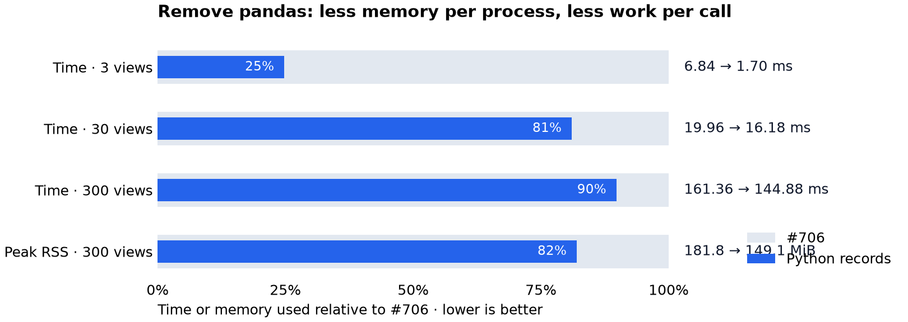

# Remove pandas from triangulation

Compare parent PR #706 (`621297934ad7eafe9858eb01c027883edb1b72f3`) with the Python-record replacement (`e34326a6958db4e12b833008057497d4f661c459`). This evidence lives on a separate branch so the feature PR contains only code, adapted tests, and dependency changes.

The two production callers already build lists of dictionaries from ORM data. Records contain native UTC datetimes. The replacement accepts and returns copied records, removing DataFrame construction, copying, filtering, tuple conversion, and result extraction. Geometry and grouping algorithms are unchanged. The candidate environment has no pandas installed and its benchmark process asserts that pandas is never imported. All shared packages have identical versions; pandas 3.0.3 is the only removed installed package.

## Results

| Workload | #706 time | Records time | Time reduction | #706 peak RSS | Records peak RSS | RSS reduction |
| --- | ---: | ---: | ---: | ---: | ---: | ---: |
| sparse / 3 views | 6.84 ms | 1.70 ms | 75.2% | 180.40 MiB | 148.07 MiB | 17.9% |
| sparse / 30 views | 19.96 ms | 16.18 ms | 19.0% | 180.63 MiB | 148.34 MiB | 17.9% |
| sparse / 300 views | 161.36 ms | 144.88 ms | 10.2% | 181.81 MiB | 149.14 MiB | 18.0% |
| clustered / 300 views | 195.88 ms | 169.24 ms | 13.6% | 182.56 MiB | 151.53 MiB | 17.0% |
| dense / 30 views | 78.79 ms | 75.79 ms | 3.8% | 181.63 MiB | 150.62 MiB | 17.1% |
| mast / 100 views | 108.36 ms | 74.36 ms | 31.4% | 183.73 MiB | 151.09 MiB | 17.8% |
| time_separated / 300 views | 160.65 ms | 142.10 ms | 11.5% | 181.41 MiB | 149.07 MiB | 17.8% |

These are synthetic workload medians, not full API latency or production memory measurements. Large geometry-heavy cases show smaller timing gains; the 3.8% change in the dense case is small relative to timing variation. Read the raw runs before drawing conclusions about small timing differences. Peak RSS fell by about 31–33 MiB (17–18%) across all seven workloads.



## Method and reproduction

Python 3.11.15, Linux x86_64, Intel Xeon Platinum 8573C; the execution container has a four-CPU quota and 16 GiB memory limit. Each of seven workloads has five fresh processes per variant, with one untimed warmup and seven timed calls. Process order is randomized with seed 706. The table uses the median of the five process medians. The separate environments have matching locked server, test, and quality dependencies.

Each child imports the full backend (`app.main`). Timing then includes the caller's DataFrame construction on #706 and `compute_overlap` on both versions. Deterministic input creation and imports are outside call timing. S3 startup is mocked; no database queries, HTTP requests, background validation workers, or model calls run. Memory is the Linux process high-water RSS (`ru_maxrss`) after import, warmup, and all seven calls. It includes native allocations and imports, uses no tracemalloc, and is independent for each condition. Import-time measurements are also recorded, but timing variation makes them unsuitable for a firm startup-latency claim.

Create two worktrees at the commits above. In each, run `uv sync --locked --group server --group test --group quality --no-install-project --python 3.11.15`. Then run:

```sh
python run.py /path/to/pr706 /path/to/records /path/to/results
/path/to/pr706/.venv/bin/python validate.py /path/to/records /path/to/pr706
uv run --no-project --with matplotlib python plot.py
```

For the plot, place the matrix output under `results/` next to `plot.py`. `raw.jsonl` contains every untraced timing and process peak. `summary.json` contains the medians. `provenance.json` records commit IDs, source hashes, environment details, and validation results.

## Validation

All 105 differential cases match the parent: IDs and ordered groups exactly, locations within 1e-8 degrees. Cases cover six graph shapes, empty inputs, shuffled IDs, mixed labels, failed cones, and naive/UTC-aware timestamps at exact time boundaries. Fourteen overlap/cone tests pass in the pandas-free environment. One small parametrized test was added for copied inputs, native datetime preservation, empty inputs, and invalid labels.

The backend suite ran against PostgreSQL 15 and Moto 5.2.3: 668 tests passed, with three storage tests rejected by Moto's strict rule for `LocationConstraint=us-east-1` and one optional Telegram check skipped. Changing only the disposable harness region to `eu-west-3` made all 20 storage tests pass, including those three. Thus all 671 runnable backend cases passed locally. Lint, format, type, lockfile, and dependency-sync checks pass. `full_tests.py` records the local harness configuration; it requires PostgreSQL on 127.0.0.1:55435 and Moto on 127.0.0.1:5567, using the dummy credentials in that file.

The feature diff removes 24 net production code lines and 68 net lines overall. `tzdata` retains the same Windows/Emscripten marker and locked version that pandas previously supplied for the existing ZoneInfo-based alert localization. The feature PR is stacked on #706; workflows filtered to `main` will run once the PR targets `main`.
